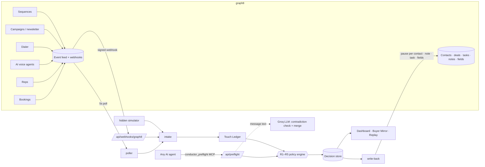

# Conductor

**One voice per buyer.** Conductor sits across every autonomous touch graph8 sends (sequences, campaigns, SMS, LinkedIn, the dialer, AI voice agents and reps) and coordinates them before the buyer feels it. When Sarah books a meeting, the SDR's sequence, the AI agent's call and the colleague's cold outreach stop on their own, and the deal owner gets a task. Every decision is written back into graph8 as a note, a task, custom fields and per-contact sequence pauses. It is deterministic rules first, with an LLM only where language matters, and it works without a human in the loop.

## The one-voice story

Sarah Khan is VP Ops at Acme. Acme has an open **$42K pilot** with AE Ali. In one week graph8 sent her **11 touches from 4 senders across 6 channels**:

- SDR Bilal's cold sequence (email, LinkedIn, SMS and a dialer voicemail)
- a newsletter, twice
- Nova, an AI voice agent

On Wednesday she **booked a meeting**. Then the AI agent called to ask whether she was "still evaluating for October", Bilal's sequence bumped her twice, and her colleague Hina was cold-sequenced too.

Nothing in that week was misconfigured. Every tool did its job; nobody coordinated them.

**The Buyer Mirror** (`/mirror/sarah`) shows that week from her side, as her phone. Her **Harmony Score is 18/100**, with 3 contradictions flagged.
**Replay** (`/replay`) runs the same week through Conductor: **11 touches → 3**, the score goes back above 90, and every blocked touch is explained by a rule.

## What it does

| | |
|---|---|
| **Touch Ledger** | Every touch, normalized: `contactId, companyId, channel, source, senderId, timestamp, snippet, refId` ([lib/ledger.ts](lib/ledger.ts)). |
| **Buyer Mirror** | The ledger from the buyer's point of view, with a summary line, a Harmony Score dial and the queued touches, each preflighted live. |
| **Harmony Score** | 100 minus fixed penalties per rule violation in the last 7 days, capped per rule. Deterministic and unit-tested ([lib/score.ts](lib/score.ts), [lib/config.ts](lib/config.ts)). |
| **Policy engine** | R1–R5 return `Decision` objects: `allow · hold · delay · reroute · escalate` ([lib/policies.ts](lib/policies.ts)). |
| **Write-back** | Note on the contact, a task for the owner, `harmony_score` / `touch_budget_remaining` / `conductor_hold` fields, and per-contact sequence pause ([lib/writeback.ts](lib/writeback.ts)). |
| **Real-time** | Signed graph8 webhooks, plus a 5-second polling fallback, plus a hidden simulator. All three go through one intake path ([lib/intake.ts](lib/intake.ts)). |
| **Preflight** | `POST /api/preflight` and the `conductor_preflight` MCP tool, so any agent can ask before it acts. |
| **LLM layer** | Groq, only two jobs: flag a queued message that contradicts what the buyer did, and merge two colliding messages into one from the owner. With no key, a timeout or a bad response, the rules still run and the UI says "AI check off" ([lib/llm.ts](lib/llm.ts)). |
| **Dashboard** | Outcome KPIs, a live Listen → Decide → Act strip, accounts sorted by score, and a plain-language decision feed showing what landed on each graph8 record. |

### Rules

| Rule | Trigger | Decision |
|---|---|---|
| **R1** | The buyer booked a meeting or replied | Hold all automation for them and cold sequences for colleagues. Hand the buyer to the owner. |
| **R2** | Open deal on the company | Hold cold outreach, and create a task for the deal owner instead. |
| **R3** | 3+ channels to one person in 24h | Delay |
| **R4** | More than 6 touches per person in 7 days | Hold |
| **R5** | 2+ senders to one person in 48h | Reroute to one owner (the deal owner, else the first human sender) |

Reps are never auto-blocked. If a rep's own action breaks a rule, it **escalates** to the owner; that is the only decision that waits for a human. All thresholds and penalties are in [lib/config.ts](lib/config.ts).

## Architecture



graph8 access is `@graph8/sdk` only, and every method used is listed and verified in [CAPABILITIES.md](CAPABILITIES.md). graph8 has no pre-send hook, so Conductor enforces decisions by reacting within seconds, using `g8.api.sequences.pauseSequenceContact` per contact, never pausing a whole sequence.

## Run it

Requires Node 22.18+ (TypeScript runs natively, so no build step is needed for scripts).

```bash
npm install
# .env.local: G8_API_KEY=..., CONDUCTOR_MODE=dry, optional GROQ_API_KEY, optional G8_WEBHOOK_SECRET
npm run seed        # create the tagged Acme scenario in graph8 (idempotent; dry mode only logs)
npm run dev         # http://localhost:3000
npm test            # rules, score, ledger, write-back, webhooks, AI fallback, replay, concurrency
npm run build
```

- `CONDUCTOR_MODE=dry` (the default) logs every intended graph8 write instead of sending it. `live` performs them.
- `npm run reset` deletes only records the seed created **and** that are still in the `conductor-demo` list.
- `npm run mcp` starts the `conductor_preflight` stdio MCP server (it is also registered in `.mcp.json`).
- `npm run webhook -- https://<public-url>` subscribes graph8 webhooks and stores the signing secret in `.env.local`. This is optional; polling works without a public URL.
- On the dashboard, press `.` (or open `/?sim`) for the demo simulator.
- `/replay?autoplay` plays Sarah's week on load; `/replay?at=8` freezes on the moment the AI call is held.

## Deploy (Vercel)

```bash
npx vercel link                       # once
npx vercel env add G8_API_KEY production          # paste the key when prompted
npx vercel env add CONDUCTOR_MODE production      # live
npx vercel env add GROQ_API_KEY production        # optional
npx vercel env add CONDUCTOR_SEED_STATE production  # contents of data/seed-state.json
npx vercel --prod
```

On Vercel there is no background process and no permanent disk, so Conductor adapts:
- **Polling runs per request.** The dashboard asks every 2s, and graph8 is read at most once every 5s.
- **State lives in `/tmp`.** A cold start simply re-scans. Decision IDs are deterministic, and write-back checks graph8 for an existing note or task, so nothing is ever written twice.
- **The graph8 ID map comes from `CONDUCTOR_SEED_STATE`**, because the gitignored `data/` folder is never uploaded (`.vercelignore`).

## Safety

- The API key lives only in `.env.local` (gitignored) and is never logged. Error messages never include request headers.
- Writes only touch contacts the seed tagged; anything else is skipped and logged.
- Webhook deliveries are verified (HMAC-SHA256 over `timestamp.body`), and unsigned deliveries get 401.
- The seeded sequence is created as a **draft and never launched**, so no real messages are sent.
